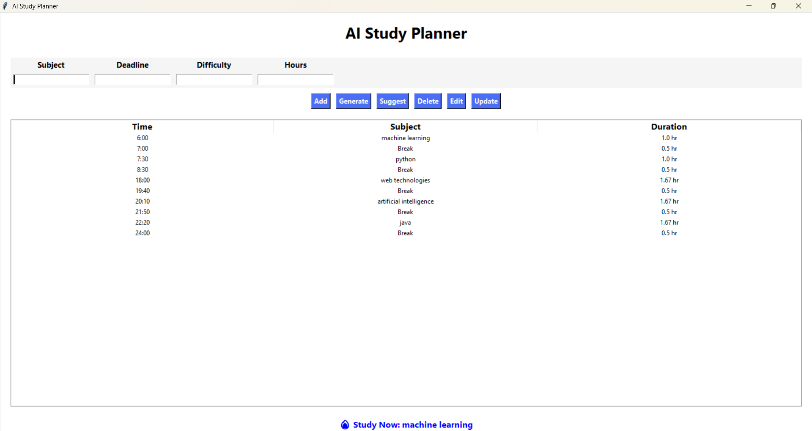

# 🧠 AI Study Planner

A smart study planner built using Python and Tkinter.

## 🚀 Features
- Add, Edit, Delete Subjects
- Smart Timetable Generation
- Suggest what to study
- Data saving using file

## ▶️ How to Run
python gui_planner.py

## 📂 Files
- gui_planner.py
- subjects.txt

## 📸 Screenshot
